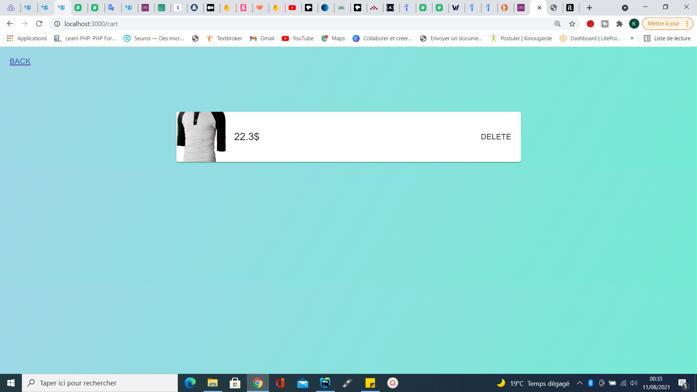

This project was bootstrapped with [Create React App](https://github.com/facebook/create-react-app), using the [Redux](https://redux.js.org/) and [Redux Toolkit](https://redux-toolkit.js.org/) template.

## Available Scripts

In the project directory, you can run:

### `npm run build`

Builds the app for production to the `build` folder. 
It correctly bundles React in production mode and optimizes the build for the best performance.

The build is minified and the filenames include the hashes. 
Your app is ready to be deployed!

See the section about [deployment](https://facebook.github.io/create-react-app/docs/deployment) for more information.

## The View

### `npm install @material-ui/core or yarn add @material-ui/core`
it's for installing the packages in your react projet 

### packages
npm install react-loader-spinner or yarn add react-loader-spinner for the loading spinner
npm install --save react-router-dom or yarn add react-router-dom

## About the project
The job is not really done , but if you understand and want to continue or if you want just to know how i do it , go ahead 

## What we missed in this learning (reactjs,redux,firebese) project
We missed to persist data when the user is connected to the page and when we are in the cart if we go back to the '/' route that will not work because product fecthing in the page is not loading (an error occurred)

